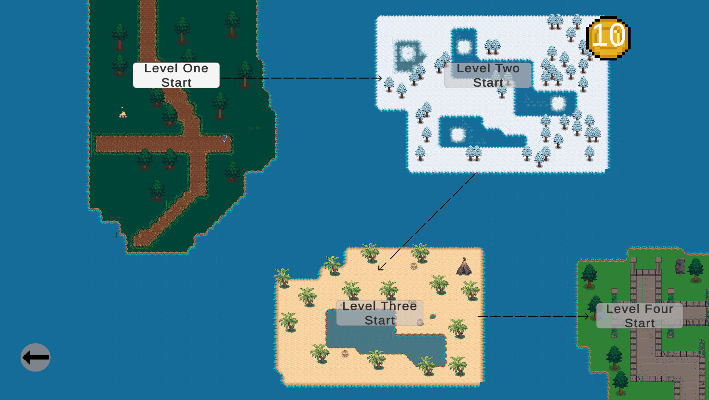
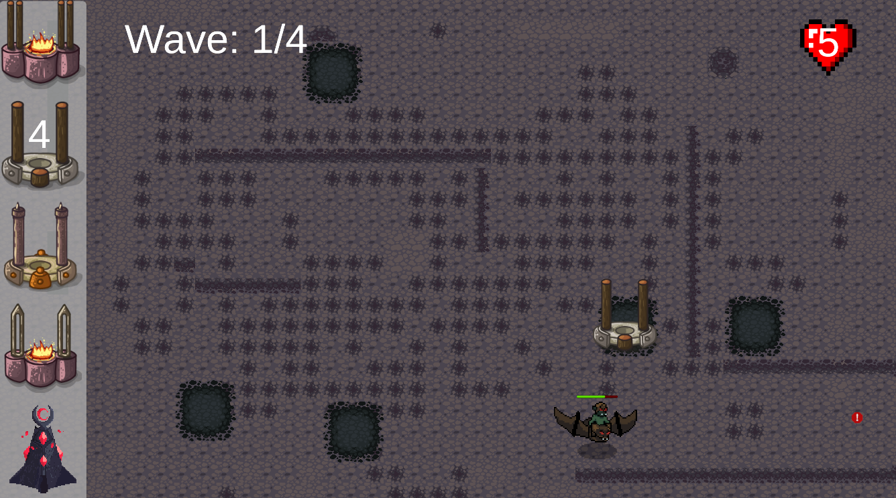
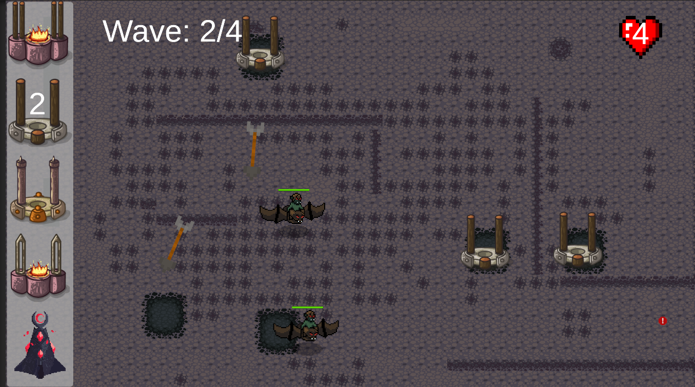

# Tower Defense Game
Simple 2D "Tower Defense" style game made in Unity - game is called Honor Watch

## How to play

    

        
        
Welcome to the game! This is the title screen. You can start a New Game, Continue the game, read the rules or Quit

    

    

        
        
After starting the game you can choose which level you want to take on. You must pass Level One first before getting to the others though

    

    

        
    

    

        
    

Some screenshots from Level One

Controls are essentially "point and click". To play click to add towers on the map.
Add towers to the designated zones on the map. There are unlimited number of towers only limited by the amount of money in the game you have.
You have a set health which is the number of hearts you have. This resets at the start of each level.
Different towers shoot different types of projectiles. 
The towers are: 
Laser towers, archer towers that fire arrows and different projectile towers such as catapult and slingshot towers. There are also magic towers.
There are a couple of types of enemies to defeat in each wave and in one level there enemies with higher health.
You can also sell a tower to gain some money or click to upgrade your tower. 
Once the wave is over and all the enemies are defeated you can click to continue to get to the next level.
## Dev Notes

### Future features
There is lots of work to do in the future and new things to add.
- Music on each level
- Continue adding sound effects
- Goal Oriented Action Planning: So that attacking forced pick the most appropriate enemies to attack the base on each wave (from a pre defined selection)

## Old content

### Features listed now added 
- Continue to the next level button
- Add magic tower with magic projectiles
- Some sound effects
- Addding more levels
- Tower upgrades so you can click on the tower and upgrade it
- Goal Oriented Action Planning: We have an enemy that uses GOAP to heal itself 
- Make different enemies suseptible to different types of projectiles

    

        
    

    

        
    

Old screenshots from the games first design